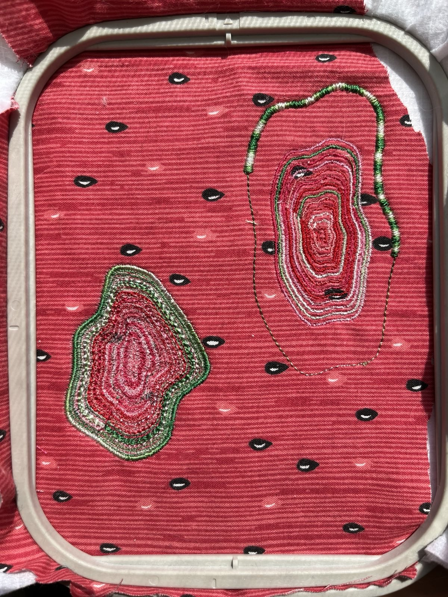
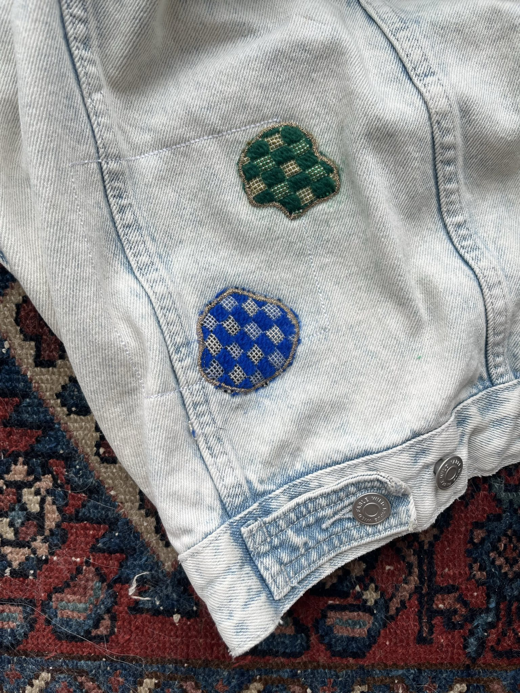

# blob generator (2)

Run in Processing with [PEmbroider](https://github.com/CreativeInquiry/PEmbroider) installed.

Based on: https://discourse.processing.org/t/help-creating-organic-looking-blobs/8777

## Current keyboard controls

- **Space Bar (` `)**: Regenerate with new noise seed
- **`d` or `D`**: Save as an embroidery pattern (`.pes`, easy to change)
- **Arrow Keys**:

  - **Up (`↑`)**: Increase radius
  - **Down (`↓`)**: Decrease radius
  - **Left (`←`)**: Decrease roundness/elongatedness
  - **Right (`→`)**: Increase roundness/elongatedness

  

  
